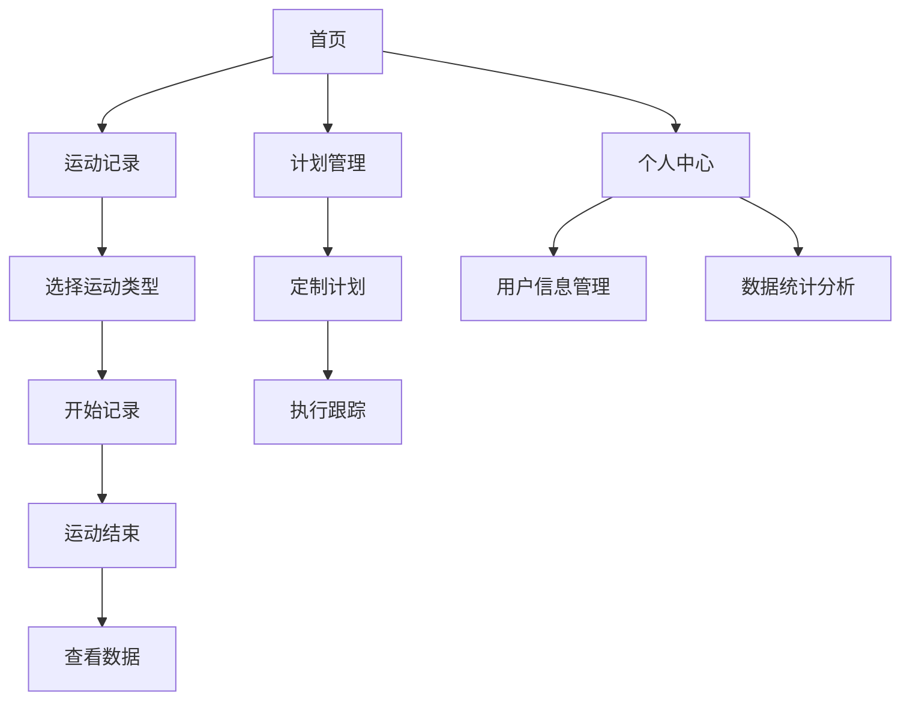

# 健身小程序 - 产品需求文档

## 1. 产品概述
健身小程序是一款帮助用户进行日常健身管理的移动应用，提供运动记录、计划制定和健康数据追踪功能。
- 主要解决用户健身计划制定、运动数据记录和健康状况监控的问题，目标用户为健身爱好者和希望改善健康状况的人群。
- 产品价值在于帮助用户建立科学的健身习惯，提高健身效果，促进健康生活方式。

## 2. 核心功能

### 2.1 用户角色
| 角色 | 注册方式 | 核心权限 |
|------|---------------------|------------------|
| 普通用户 | 手机号注册 | 浏览和使用基本功能 |
| 高级用户 | 订阅升级 | 额外的数据分析和定制计划 |

### 2.2 功能模块
1. **首页**：运动数据概览、快捷入口、推荐内容
2. **运动记录**：运动类型选择、数据记录、历史查看
3. **计划管理**：定制健身计划、计划执行跟踪
4. **个人中心**：用户信息、设置、数据统计

### 2.3 页面详情
| 页面名称 | 模块名称 | 功能描述 |
|-----------|-------------|---------------------|
| 首页 | 数据概览 | 展示今日运动数据、周统计、目标完成情况 |
| 首页 | 快捷入口 | 快速开始运动、查看计划、进入记录 |
| 首页 | 推荐内容 | 基于用户习惯推荐运动类型和计划 |
| 运动记录 | 运动类型选择 | 提供多种运动类型供选择（跑步、骑行、健身等） |
| 运动记录 | 数据记录 | 实时记录运动数据（距离、时间、卡路里等） |
| 运动记录 | 历史查看 | 查看历史运动记录和数据趋势 |
| 计划管理 | 计划定制 | 根据用户目标和身体状况定制健身计划 |
| 计划管理 | 执行跟踪 | 跟踪计划执行情况，提供完成度统计 |
| 个人中心 | 用户信息 | 管理个人资料、目标设置 |
| 个人中心 | 数据统计 | 提供详细的运动数据统计和分析 |

## 3. 核心流程
用户注册登录后，可在首页查看运动概览，通过快捷入口开始运动记录或查看计划。用户可以在运动记录页面选择运动类型并开始记录，运动结束后查看详细数据。用户还可以在计划管理页面定制健身计划并跟踪执行情况。个人中心页面提供用户信息管理和详细数据统计。

## 4. 用户界面设计
### 4.1 设计风格
- 主色调：蓝色 (#1E88E5) 和绿色 (#4CAF50)
- 辅助色：橙色 (#FF9800) 用于强调和按钮
- 按钮风格：圆角按钮，有轻微的3D效果
- 字体：无衬线字体，主标题18px，副标题16px，正文14px
- 布局风格：卡片式布局，清晰的信息层级
- 图标风格：简洁的线性图标，配合主题色

### 4.2 页面设计概览
| 页面名称 | 模块名称 | UI元素 |
|-----------|-------------|-------------|
| 首页 | 数据概览 | 圆形进度条展示目标完成度，卡片式数据展示，柔和的阴影效果 |
| 首页 | 快捷入口 | 图标+文字的网格布局，点击有轻微的动画效果 |
| 首页 | 推荐内容 | 卡片式设计，包含图片和简短描述，滑动切换 |
| 运动记录 | 运动类型选择 | 图标+文字的列表，选中状态有明显的视觉反馈 |
| 运动记录 | 数据记录 | 大字体显示实时数据，背景为深色以突出数据 |
| 运动记录 | 历史查看 | 列表式展示，可按日期筛选，点击进入详情 |
| 计划管理 | 计划定制 | 表单式设计，步骤引导，实时预览计划效果 |
| 计划管理 | 执行跟踪 | 进度条展示完成情况，日历视图标记执行状态 |
| 个人中心 | 用户信息 | 头像+基本信息，列表式设置项，简洁明了 |
| 个人中心 | 数据统计 | 图表展示数据趋势，可切换不同时间维度 |

### 4.3 响应式设计
- 移动端优先设计，适配不同屏幕尺寸
- 触摸优化，按钮和可点击区域大小适合手指点击
- 横屏模式支持，优化数据展示

### 4.4 3D场景指导
- 可选的3D运动指导，展示正确的运动姿势
- 环境：简洁的室内健身场景
- 光照：柔和的自然光效果
- 相机：多角度展示，可交互旋转
- 动画：流畅的运动示范动画
- 后期处理：轻微的景深效果，突出主体

## 5. 验收标准

### AC-1: 用户注册登录
- **Given**: 用户打开应用
- **When**: 用户输入手机号和密码进行注册/登录
- **Then**: 用户成功注册/登录，进入首页
- **Verification**: `programmatic`

### AC-2: 运动记录
- **Given**: 用户在运动记录页面
- **When**: 用户选择运动类型并开始记录
- **Then**: 应用实时记录运动数据，运动结束后显示详细数据
- **Verification**: `programmatic`

### AC-3: 计划管理
- **Given**: 用户在计划管理页面
- **When**: 用户创建健身计划并开始执行
- **Then**: 应用跟踪计划执行情况，显示完成度统计
- **Verification**: `programmatic`

### AC-4: 数据统计
- **Given**: 用户在个人中心页面
- **When**: 用户查看数据统计
- **Then**: 应用展示详细的运动数据统计和趋势图表
- **Verification**: `programmatic`

### AC-5: 3D运动指导
- **Given**: 用户查看运动指导
- **When**: 用户选择3D运动指导
- **Then**: 应用显示3D运动模型和动画，用户可以交互查看
- **Verification**: `human-judgment`

## 6. 开放问题
- [ ] 3D运动指导的具体实现方式和性能优化
- [ ] 高级用户订阅功能的具体实现
- [ ] 数据同步和备份策略
- [ ] 与其他健康应用的集成方案
- [ ] 离线功能的实现范围