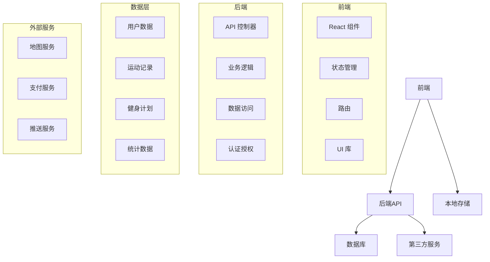
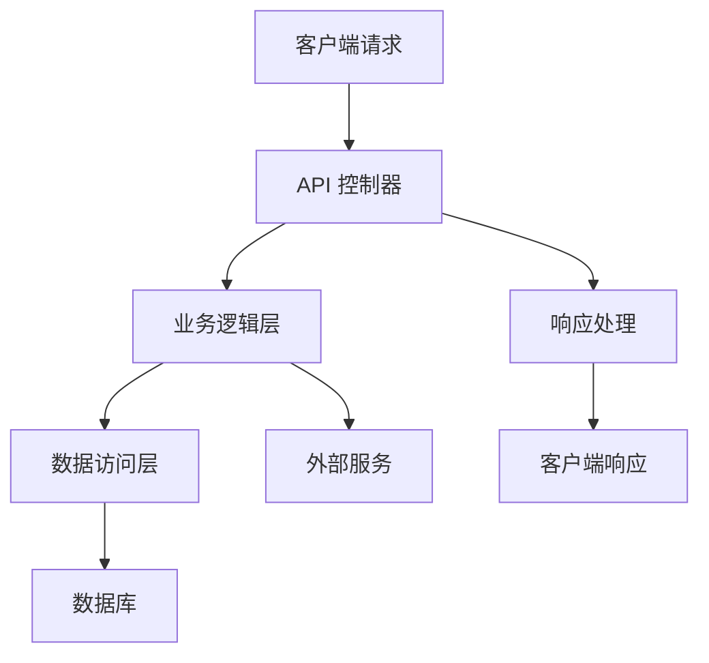

# 健身小程序 - 技术架构文档

## 1. 架构设计



## 2. 技术栈
- 前端：React@18 + Tailwind CSS@3 + Vite
- 初始化工具：Vite
- 后端：Express@4
- 数据库：PostgreSQL
- 认证：JWT
- 状态管理：Redux Toolkit
- 路由：React Router
- UI 组件库：自定义组件 + React Icons
- 3D 渲染：Three.js + @react-three/fiber
- 图表：Chart.js
- 网络请求：Axios

## 3. 路由定义

| 路由 | 目的 |
|-------|---------|
| / | 首页 - 运动数据概览 |
| /record | 运动记录页面 |
| /record/type | 运动类型选择 |
| /record/active | 运动中实时记录 |
| /record/history | 历史运动记录 |
| /plan | 计划管理页面 |
| /plan/create | 创建健身计划 |
| /plan/detail/:id | 计划详情和执行跟踪 |
| /profile | 个人中心页面 |
| /profile/settings | 设置页面 |
| /profile/stats | 数据统计页面 |
| /auth | 认证相关页面 |
| /auth/login | 登录页面 |
| /auth/register | 注册页面 |

## 4. API 定义

### 4.1 用户相关

#### 注册
- **请求**：POST /api/auth/register
- **参数**：
  - phone: string (手机号)
  - password: string (密码)
  - name: string (用户名)
- **响应**：
  - success: boolean
  - data: { user: User, token: string }
  - error: string (如果失败)

#### 登录
- **请求**：POST /api/auth/login
- **参数**：
  - phone: string (手机号)
  - password: string (密码)
- **响应**：
  - success: boolean
  - data: { user: User, token: string }
  - error: string (如果失败)

#### 获取用户信息
- **请求**：GET /api/user/profile
- **响应**：
  - success: boolean
  - data: User
  - error: string (如果失败)

#### 更新用户信息
- **请求**：PUT /api/user/profile
- **参数**：
  - name: string (可选)
  - avatar: string (可选，头像URL)
  - height: number (可选，身高cm)
  - weight: number (可选，体重kg)
  - goal: string (可选，健身目标)
- **响应**：
  - success: boolean
  - data: User
  - error: string (如果失败)

### 4.2 运动记录相关

#### 创建运动记录
- **请求**：POST /api/records
- **参数**：
  - type: string (运动类型)
  - duration: number (时长，分钟)
  - distance: number (距离，公里，可选)
  - calories: number (消耗卡路里)
  - start_time: string (开始时间，ISO格式)
  - end_time: string (结束时间，ISO格式)
  - notes: string (备注，可选)
- **响应**：
  - success: boolean
  - data: Record
  - error: string (如果失败)

#### 获取运动记录列表
- **请求**：GET /api/records
- **参数**：
  - page: number (页码，可选)
  - limit: number (每页数量，可选)
  - start_date: string (开始日期，可选)
  - end_date: string (结束日期，可选)
  - type: string (运动类型，可选)
- **响应**：
  - success: boolean
  - data: { records: Record[], total: number }
  - error: string (如果失败)

#### 获取运动记录详情
- **请求**：GET /api/records/:id
- **响应**：
  - success: boolean
  - data: Record
  - error: string (如果失败)

#### 删除运动记录
- **请求**：DELETE /api/records/:id
- **响应**：
  - success: boolean
  - error: string (如果失败)

### 4.3 计划相关

#### 创建健身计划
- **请求**：POST /api/plans
- **参数**：
  - name: string (计划名称)
  - description: string (计划描述)
  - duration: number (计划时长，天)
  - exercises: Array<Exercise> (锻炼项目)
  - goal: string (目标)
- **响应**：
  - success: boolean
  - data: Plan
  - error: string (如果失败)

#### 获取计划列表
- **请求**：GET /api/plans
- **响应**：
  - success: boolean
  - data: Plan[]
  - error: string (如果失败)

#### 获取计划详情
- **请求**：GET /api/plans/:id
- **响应**：
  - success: boolean
  - data: Plan
  - error: string (如果失败)

#### 更新计划执行状态
- **请求**：PUT /api/plans/:id/execution
- **参数**：
  - day: number (第几天)
  - completed: boolean (是否完成)
  - notes: string (备注，可选)
- **响应**：
  - success: boolean
  - data: Plan
  - error: string (如果失败)

### 4.4 统计相关

#### 获取统计数据
- **请求**：GET /api/stats
- **参数**：
  - period: string (周期：day, week, month, year)
  - start_date: string (开始日期，可选)
  - end_date: string (结束日期，可选)
- **响应**：
  - success: boolean
  - data: Stats
  - error: string (如果失败)

## 5. 服务器架构图



## 6. 数据模型

### 6.1 数据模型定义

```mermaid
erDiagram
    USER ||--o{ RECORD : has
    USER ||--o{ PLAN : creates
    PLAN ||--o{ EXERCISE : contains
    USER ||--o{ EXECUTION : tracks
    EXECUTION }o--|| PLAN : belongs_to

    USER {
        id SERIAL PK
        phone VARCHAR(20) UNIQUE
        password VARCHAR(100)
        name VARCHAR(50)
        avatar VARCHAR(255)
        height FLOAT
        weight FLOAT
        goal VARCHAR(100)
        role VARCHAR(20) DEFAULT 'user'
        created_at TIMESTAMP
        updated_at TIMESTAMP
    }

    RECORD {
        id SERIAL PK
        user_id INTEGER FK
        type VARCHAR(50)
        duration INTEGER
        distance FLOAT
        calories INTEGER
        start_time TIMESTAMP
        end_time TIMESTAMP
        notes TEXT
        created_at TIMESTAMP
    }

    PLAN {
        id SERIAL PK
        user_id INTEGER FK
        name VARCHAR(100)
        description TEXT
        duration INTEGER
        goal VARCHAR(100)
        created_at TIMESTAMP
        updated_at TIMESTAMP
    }

    EXERCISE {
        id SERIAL PK
        plan_id INTEGER FK
        name VARCHAR(100)
        sets INTEGER
        reps INTEGER
        weight FLOAT
        duration INTEGER
        order INTEGER
    }

    EXECUTION {
        id SERIAL PK
        user_id INTEGER FK
        plan_id INTEGER FK
        day INTEGER
        completed BOOLEAN DEFAULT false
        notes TEXT
        executed_at TIMESTAMP
    }
```

### 6.2 数据定义语言

#### 用户表
```sql
CREATE TABLE users (
    id SERIAL PRIMARY KEY,
    phone VARCHAR(20) UNIQUE NOT NULL,
    password VARCHAR(100) NOT NULL,
    name VARCHAR(50) NOT NULL,
    avatar VARCHAR(255),
    height FLOAT,
    weight FLOAT,
    goal VARCHAR(100),
    role VARCHAR(20) DEFAULT 'user',
    created_at TIMESTAMP DEFAULT CURRENT_TIMESTAMP,
    updated_at TIMESTAMP DEFAULT CURRENT_TIMESTAMP
);

CREATE INDEX idx_users_phone ON users(phone);
```

#### 运动记录表
```sql
CREATE TABLE records (
    id SERIAL PRIMARY KEY,
    user_id INTEGER REFERENCES users(id),
    type VARCHAR(50) NOT NULL,
    duration INTEGER NOT NULL,
    distance FLOAT,
    calories INTEGER NOT NULL,
    start_time TIMESTAMP NOT NULL,
    end_time TIMESTAMP NOT NULL,
    notes TEXT,
    created_at TIMESTAMP DEFAULT CURRENT_TIMESTAMP
);

CREATE INDEX idx_records_user_id ON records(user_id);
CREATE INDEX idx_records_start_time ON records(start_time);
CREATE INDEX idx_records_type ON records(type);
```

#### 计划表
```sql
CREATE TABLE plans (
    id SERIAL PRIMARY KEY,
    user_id INTEGER REFERENCES users(id),
    name VARCHAR(100) NOT NULL,
    description TEXT,
    duration INTEGER NOT NULL,
    goal VARCHAR(100),
    created_at TIMESTAMP DEFAULT CURRENT_TIMESTAMP,
    updated_at TIMESTAMP DEFAULT CURRENT_TIMESTAMP
);

CREATE INDEX idx_plans_user_id ON plans(user_id);
```

#### 锻炼项目表
```sql
CREATE TABLE exercises (
    id SERIAL PRIMARY KEY,
    plan_id INTEGER REFERENCES plans(id),
    name VARCHAR(100) NOT NULL,
    sets INTEGER,
    reps INTEGER,
    weight FLOAT,
    duration INTEGER,
    "order" INTEGER NOT NULL
);

CREATE INDEX idx_exercises_plan_id ON exercises(plan_id);
```

#### 执行记录表
```sql
CREATE TABLE executions (
    id SERIAL PRIMARY KEY,
    user_id INTEGER REFERENCES users(id),
    plan_id INTEGER REFERENCES plans(id),
    day INTEGER NOT NULL,
    completed BOOLEAN DEFAULT false,
    notes TEXT,
    executed_at TIMESTAMP DEFAULT CURRENT_TIMESTAMP
);

CREATE INDEX idx_executions_user_id ON executions(user_id);
CREATE INDEX idx_executions_plan_id ON executions(plan_id);
CREATE UNIQUE INDEX idx_executions_user_plan_day ON executions(user_id, plan_id, day);
```